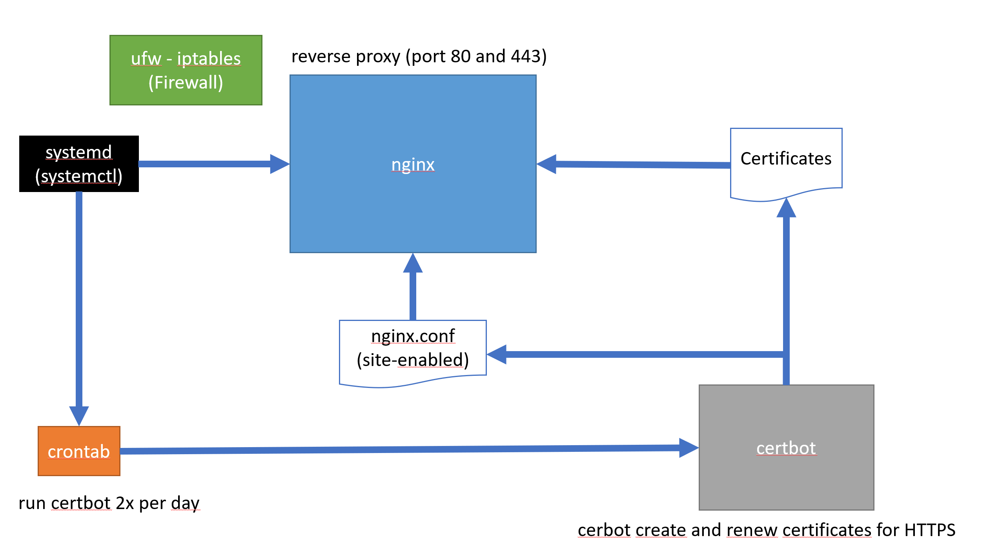
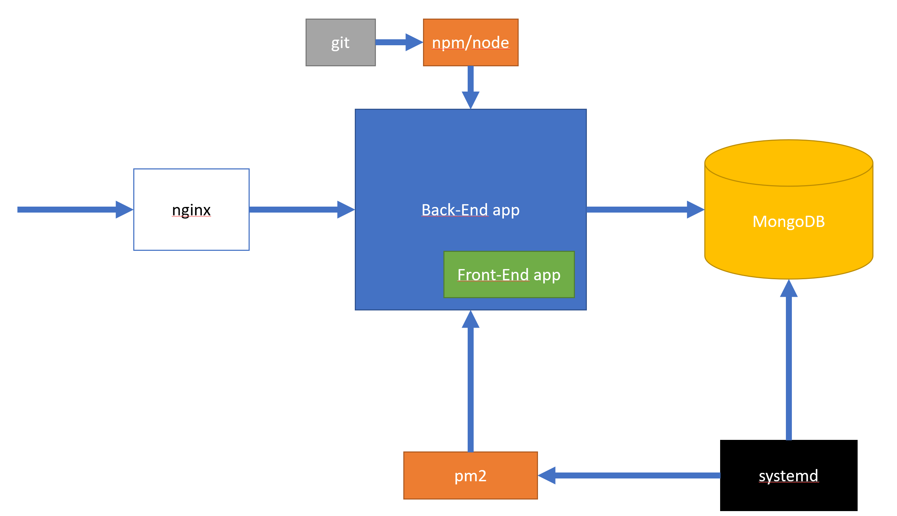

<h1>Gestion Stock</h1>

An example of angular web app with nodejs back-end.

- [Production Deployment](#production-deployment)
  - [Target description](#target-description)
  - [Prerequisites](#prerequisites)
    - [Identify your linux](#identify-your-linux)
    - [Identify your Linux init system](#identify-your-linux-init-system)
  - [Machine upgrade](#machine-upgrade)
  - [Git installation](#git-installation)
  - [nginx (re)installation](#nginx-reinstallation)
    - [purge nginx](#purge-nginx)
    - [Reboot](#reboot)
    - [Install nginx](#install-nginx)
  - [Nodejs](#nodejs)
  - [PM2](#pm2)
  - [Firewall UFW](#firewall-ufw)
  - [MongoDB](#mongodb)
  - [Project install](#project-install)
  - [Start the project with PM2](#start-the-project-with-pm2)
  - [Make the DNS working](#make-the-dns-working)
  - [Configure NGINX as a reverse proxy](#configure-nginx-as-a-reverse-proxy)
  - [Certbot (HTTPS)](#certbot-https)
  - [OAuth2 providers](#oauth2-providers)
- [Update the software](#update-the-software)
- [Author](#author)

# Production Deployment

## Target description

In this documentation the production machine is a OVH VPS Debian 10.
The production macjine serves the back-end API and the front-end application.
It is started with pm2.
It run behind a proxy nginx that maintains the https connection.





## Prerequisites

Open a root terminal on your production system.

### Identify your linux

Confirm your linux distribution:

```sh
$ lsb_release -a
No LSB modules are available.
Distributor ID: Debian
Description:    Debian GNU/Linux 10 (buster)
Release:        10
Codename:       buster
```

You can also use:

```sh
$ uname -a
Linux vps716174 4.19.0-13-cloud-amd64 #1 SMP Debian 4.19.160-2 (2020-11-28) x86_64 GNU/Linux
```

### Identify your Linux init system

The init system is the first process started by Linux, it manages the permanent processes.

```sh
$ ps --no-headers -o comm 1
systemd
```

The answer should be `systemd` or `init`.
The `systemd` is managed by the user interface command `systemctl`.

## Machine upgrade

If you use a Debian (or Debian derivates like Ubuntu), you should have the `apt` command to install and manage packages.

```sh
$ sudo apt update
$ sudo apt list --upgradable
$ sudo apt upgrade
```

May be some packages will not be upgraded because they are running (ex: ngninx, etc.). We will upgrade them later.

## Git installation

```sh
$ sudo apt install git
```

```sh
$ git --version
git version 2.20.1
```

## nginx (re)installation

### purge nginx

How to stop it:

```sh
sudo systemctl stop nginx
```

How to remove it:

```sh
$ sudo apt remove nginx
$ sudo apt remove nginx-full
# remove also the dependancies
$ sudo apt autoremove
```

How to purge the nginx configuration files:

```sh
rm -rf /etc/nginx
```

A linux system have services. Services are permanent processes running in background that are automatically launched when linux is starting. There is a utility called `systemctl` that manages the linux services.

How to remove nginx from `systemctl`:
https://superuser.com/questions/513159/how-to-remove-systemd-services

Checking the service list:

```sh
$ systemctl --type=service
```

### Reboot

```sh
$ systemctl reboot
```

### Install nginx

Source: https://www.digitalocean.com/community/tutorials/how-to-install-nginx-on-debian-10

```sh
$ sudo apt install nginx
```

Check the status of the installation: Nginx should be started as a systemctl service.

```sh
$ sudo systemctl status nginx
```

You should see that the service is `Loaded` and `Active`

Get the IP address of your production machine:

```sh
$ ifconfig
```

or

```sh
hostname -I
```

Open a browser and go on your production site:

```
http://<ip-address>
```

Note that for the time being we do not use a firewall (the firewall software is `ufw`). This aspect will be considered later.

## Nodejs

Uninstall a previous node:

```sh
$ sudo apt remove nodejs
```

Install a new nodejs (ex: version 16 LTS)
https://github.com/nodesource/distributions/blob/master/README.md

```sh
# Using Debian, as root
curl -fsSL https://deb.nodesource.com/setup_16.x | bash -
apt-get install -y nodejs
```

## PM2

Uninstall pm2:

```sh
# if pm2 is installed just remove the prod software from it.
$ pm2 delete all
$ npm uninstall -g pm2
$ cd
$ rm -rf .pm2
```

Install pm2

```sh
npm i -g pm2
```

## Firewall UFW

UFW is a firewall very simple to use.

```sh
$ sudo apt update
$ sudo apt install ufw
```

Configure the minimum rules:

```sh
$ sudo ufw allow ssh
$ sudo ufw allow http
$ sudo ufw allow https
```

Enable the firewall.

```sh
$ sudo ufw enable
```

Check the status:

```sh
$ sudo ufw status
Status: active

To                         Action      From
--                         ------      ----
22/tcp                     ALLOW       Anywhere
80/tcp                     ALLOW       Anywhere
443/tcp                    ALLOW       Anywhere
22/tcp (v6)                ALLOW       Anywhere (v6)
80/tcp (v6)                ALLOW       Anywhere (v6)
443/tcp (v6)               ALLOW       Anywhere (v6)
```

## MongoDB

Check if mongo is installed:

```sh
$ mongod --version
```

Install mongo

Check the official doc: https://docs.mongodb.com/manual/tutorial/install-mongodb-on-debian/

```sh
$ wget -qO - https://www.mongodb.org/static/pgp/server-5.0.asc | sudo apt-key add -
OK
```

Add a new repo in APT source list:

```sh
$ echo "deb http://repo.mongodb.org/apt/debian buster/mongodb-org/5.0 main" | sudo tee /etc/apt/sources.list.d/mongodb-org-5.0.list
```

Reload the APT package list

```sh
$ sudo apt-get update
```

Install MongoDB (latest version)

```sh
$ sudo apt-get install -y mongodb-org
```

To be sure, reload the daemons (permanent processes on Linux)

```sh
$ sudo systemctl daemon-reload
```

Start Mongo

```sh
$ sudo systemctl start mongod
```

Verify Mongo is started:

```sh
$ sudo systemctl status mongod
```

If you want to stop or restart mongod:

```sh
$ sudo systemctl stop mongod
$ sudo systemctl restart mongod
```

Connect to Mongo and show the database list:

```sh
$ mongosh
test>show databases;
admin     41 kB
config  12.3 kB
local   73.7 kB
test>quit;
```

Data produced by Mongo are stored here:

```sh
/var/log/mongodb
/var/lib/mongodb
```

## Project install

Please do not use the root account (for security reason).
Create a unix user account if needed.

You may need to generate a github personal access token (the github password won't work).
Source : https://www.edgoad.com/2021/02/using-personal-access-tokens-with-git-and-github.html

```sh
git config --global user.name "Your NAME"
git config --global user.email "your@address.email.com"
git config --global credential.helper cache
git config -l
```

Note: if you want to remove the personal access token from the cache:

```sh
git config --global --unset credential.helper
```

When cloning the project, you will be asked for a password. Enter instead the personal access token.

```sh
cd $HOME
mkdir projects
cd projects
git clone https://github.com/jlg-formation/fuj-juillet-2020.git
cd fuj-juillet-2020
cd front
npm i
npm run build
cd ../back
npm i
npm run compile
```

## Start the project with PM2

Create an `ecosystem.config.js` file in the `fuj-juillet-2020/back` directory.
Example:

```js
module.exports = {
  apps: [
    {
      name: "Wiame API Node Server",
      script: "build/src/index.js",
      env: {
        WIAME_NODESERVER_PORT: 3050,
      },
      env_production: {
        WIAME_NODESERVER_PORT: 3333,
        OAUTH2_PROVIDER_LIST: "GITHUB,AZUREAD",

        OAUTH2_GITHUB_CLIENT_ID: "xxxxxx",
        OAUTH2_GITHUB_CLIENT_SECRET: "xxxxxx",
        OAUTH2_GITHUB_AUTHORIZATION_URL:
          "https://github.com/login/oauth/authorize",
        OAUTH2_GITHUB_ACCESS_TOKEN_URL:
          "https://github.com/login/oauth/access_token",

        OAUTH2_AZUREAD_CLIENT_ID: "xxxxxx",
        OAUTH2_AZUREAD_CLIENT_SECRET: "xxxxxx",
        OAUTH2_AZUREAD_AUTHORIZATION_URL:
          "https://login.microsoftonline.com/common/oauth2/v2.0/authorize",
        OAUTH2_AZUREAD_ACCESS_TOKEN_URL:
          "https://login.microsoftonline.com/common/oauth2/v2.0/token",

        OAUTH2_TESTPROVIDER_CLIENT_ID: "test_client_id",
        OAUTH2_TESTPROVIDER_CLIENT_SECRET: "test_secret_id",
        OAUTH2_TESTPROVIDER_AUTHORIZATION_URL: "/api/test-provider/authorize",
        OAUTH2_TESTPROVIDER_ACCESS_TOKEN_URL: "/api/test-provider/token",
      },
    },
  ],
};
```

In the `back` directory run:

```sh
$ pm2 start ecosystem.config.js --env production
```

Briefly test without the firewall.

```sh
$ sudo ufw disable
```

Test on your browser:
`http://xx.xx.xx.xx:3333`

```sh
$ ufw --force enable
```

Make sure PM2 will restart the website on Linux startup.

`pm2 startup` will configure `systemd`.

```sh
$ pm2 startup
$ pm2 save
```

## Make the DNS working

Connect to your DNS provider (for instance OVH) and add an entry to the DNS (A record): it is a mapping between the domain (ex: gestion-stock.yoursite.com) and your Linux internet IP address (`ifconfig eth0`).

Disable the firewall.

```sh
$ sudo ufw disable
```

Open a browser and go to http://gestion-stock.yoursite.com:3333

Reenable the firewall.

```sh
$ ufw --force enable
```

## Configure NGINX as a reverse proxy

In the directory `/etc/nginx/sites-available` you store the different config for web sites.

Create a file called `/etc/nginx/sites-available/gestion-stock.yoursite.com` with the following content:

```
server {
    listen 80;
    listen [::]:80;

    server_name gestion-stock.yoursite.com;


    location / {
        proxy_pass http://127.0.0.1:3333;
    }
}
```

Create a symbolic soft link to the `/etc/nginx/sites-enabled` directory.

```sh
$ cd /etc/nginx/sites-enabled
$ ln -s ../sites-available/gestion-stock.yoursite.com.conf .
```

Test the nginx config:

```sh
$ sudo nginx -t
```

If success, reload nginx.

```sh
$ sudo nginx -s reload
```

Open a browser and test the url `http://gestion-stock.yoursite.com`

## Certbot (HTTPS)

Source: https://www.digitalocean.com/community/tutorials/how-to-secure-nginx-with-let-s-encrypt-on-debian-10

Install Certbot:

```sh
$ sudo apt update
$ sudo apt install python3-acme python3-certbot python3-mock python3-openssl python3-pkg-resources python3-pyparsing python3-zope.interface
```

```sh
sudo apt install python3-certbot-nginx
```

Install the certificate:

```sh
$ sudo certbot --nginx -d gestion-stock.yoursite.com
# Choose REDIRECT http to https
```

The `gestion-stock.yoursite.com.conf` file should look like this:

```
server {

    server_name gestion-stock.yoursite.com;


    location / {
        proxy_pass http://127.0.0.1:3333;
    }

    listen [::]:443 ssl ipv6only=on; # managed by Certbot
    listen 443 ssl; # managed by Certbot
    ssl_certificate /etc/letsencrypt/live/gestion-stock.yoursite.com/fullchain.pem; # managed by Certbot
    ssl_certificate_key /etc/letsencrypt/live/gestion-stock.yoursite.com/privkey.pem; # managed by Certbot
    include /etc/letsencrypt/options-ssl-nginx.conf; # managed by Certbot
    ssl_dhparam /etc/letsencrypt/ssl-dhparams.pem; # managed by Certbot

}

server {
    if ($host = gestion-stock.yoursite.com) {
        return 301 https://$host$request_uri;
        } # managed by Certbot


        listen 80;
        listen [::]:80;

        server_name gestion-stock.yoursite.com;
        return 404; # managed by Certbot


    }
```

## OAuth2 providers

Make sure the redirect URI are well configured on Github and Microsoft Azure AD.

The callback URL must be configured to:

For Github

```
https://gestion-stock.yoursite.com/api/oauth2/redirect/GITHUB
```

For Microsoft Azure AD

```
https://gestion-stock.jlg-consulting.com/api/oauth2/redirect/AZUREAD
```

# Update the software

```sh
cd $HOME
cd projects
cd fuj-juillet-2020
git pull
cd front
npm i
npm run build
cd ..
cd back
npm i
npm run compile
pm2 delete GStock
pm2 start ecosystem.config.js --env production
```

# Author

Jean-Louis GUENEGO <jlguenego@gmail.com>

```

```
